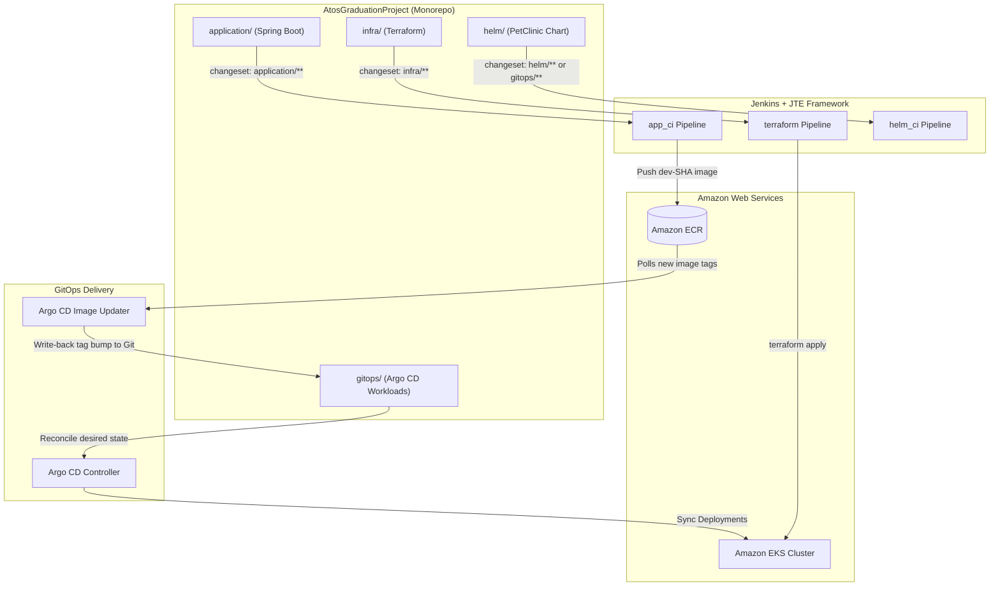

# Jenkins Templating Engine (JTE) — Enterprise CI/CD Framework

A production-grade, modular CI/CD pipeline framework built on the [Jenkins Templating Engine (JTE)](https://plugins.jenkins.io/templating-engine/). This repository provides reusable JTE libraries, lifecycle hooks, and pipeline templates for microservice applications, Helm charts, GitOps manifests, and cloud infrastructure provisioning.

---

## Table of Contents

- [1. Architecture Overview](#1-architecture-overview)
  - [Core Principles](#core-principles)
  - [System Flow & GitOps Ecosystem](#system-flow--gitops-ecosystem)
- [2. Repository Structure](#2-repository-structure)
- [3. Pipeline Templates Catalog](#3-pipeline-templates-catalog)
  - [Atos Graduation Project: Application CI/CD (`app_ci`)](#31-atos-graduation-project-application-cicd-app_ci)
  - [Atos Graduation Project: Infrastructure CI/CD (`terraform`)](#32-atos-graduation-project-infrastructure-cicd-terraform)
  - [Atos Graduation Project: Helm & GitOps CI (`helm_ci`)](#33-atos-graduation-project-helm--gitops-ci-helm_ci)
  - [CI/CD Project: Node.js Application Pipeline (`app_CI`)](#34-cicd-project-nodejs-application-pipeline-app_ci)
  - [CI/CD Project: Application Deployment Pipeline (`app_CD`)](#35-cicd-project-application-deployment-pipeline-app_cd)
  - [CI/CD Project: Terraform & Ansible Integration](#36-cicd-project-terraform--ansible-integration)
- [4. Libraries Reference Manual (15 Libraries)](#4-libraries-reference-manual)
  - [aws](#41-aws-library)
  - [ecr](#42-ecr-library)
  - [docker](#43-docker-library)
  - [helm](#44-helm-library)
  - [maven](#45-maven-library)
  - [sonar](#46-sonar-library)
  - [trivy](#47-trivy-library)
  - [change_detection](#48-change_detection-library)
  - [release](#49-release-library)
  - [version_manager](#410-version_manager-library)
  - [gitops](#411-gitops-library)
  - [kubernetes](#412-kubernetes-library)
  - [terraform](#413-terraform-library)
  - [ansible](#414-ansible-library)
  - [npm](#415-npm-library)
- [5. Cross-Cutting Architectural Patterns](#5-cross-cutting-architectural-patterns)
  - [AWS STS Role Assumption & Credential Scoping](#51-aws-sts-role-assumption--credential-scoping)
  - [Monorepo Path Filtering (`changeset`)](#52-monorepo-path-filtering-changeset)
  - [GitOps: CI Validation vs CD Reconciliation](#53-gitops-ci-validation-vs-cd-reconciliation)
- [6. Setup, Prerequisites & Credentials](#6-setup-prerequisites--credentials)

---

## 1. Architecture Overview

### Core Principles

1. **Decoupled Primitives (Single Responsibility)**: Pipeline steps perform a single, discrete action (e.g. compile, push, lint). A step never invokes another step directly.
2. **Aspect-Oriented Governance via Lifecycle Hooks**: Cross-cutting requirements (security scanning, Docker registry login, workspace cleanup) are transparently enforced using JTE lifecycle hooks (`@Validate`, `@BeforeStep`, `@AfterStep`, `@CleanUp`).
3. **Immutable Artifacts**: Container images are built once during the CI stage. Promotions across environments (`dev` → `test` → `prod`) only retag or reassign the exact pre-verified image digest.
4. **Git as the Single Source of Truth (GitOps)**: Jenkins handles **CI** (validation, testing, containerization, security scanning). **Argo CD** handles **CD** (declarative state synchronization with the Kubernetes cluster).

### System Flow & GitOps Ecosystem



---

## 2. Repository Structure

```
JTE/
├── README.md                                     # Master Framework Documentation
│
├── libraries/                                    # Reusable JTE Libraries
│   ├── ansible/                                  # Ansible playbook execution & inventory
│   ├── aws/                                      # AWS STS assumeRole wrapper
│   ├── change_detection/                         # Git diff & monorepo path analyzers
│   ├── docker/                                   # Docker image build, validation, & push
│   ├── ecr/                                      # AWS ECR authentication, exists, & retag
│   ├── gitops/                                   # PR creation, value updates, guardrails
│   ├── helm/                                     # Helm lint, template rendering, & security
│   ├── kubernetes/                               # kubectl manifests & deployment
│   ├── maven/                                    # Java Maven compile, package, & test
│   ├── npm/                                      # Node.js install, test, lint, & audit
│   ├── release/                                  # Git versioning & automated tagging
│   ├── sonar/                                    # SonarQube Maven analysis & quality gate
│   ├── terraform/                                # IaC init, checkov, plan, & apply
│   ├── trivy/                                    # Container & filesystem vulnerability scanner
│   └── version_manager/                          # S3-backed JSON version registry
│
└── pipelines_templates/                          # Pipeline Templates
    ├── AtosGradProj/                             # Primary Graduation Project
    │   ├── app_ci/                               # Spring Boot Application CI/CD
    │   ├── terraform/                            # Infrastructure as Code (Terraform)
    │   └── helm_ci/                              # Helm Chart & GitOps Validation
    └── CI_CD_Project/                            # Reference Implementation
        ├── app_CI/                               # Node.js Application CI
        ├── app_CD/                               # Kubernetes Manifest Deployment CD
        ├── terraform_infra/                      # Base Infrastructure IaC
        └── ansible_pipeline/                     # Ansible Configuration Pipeline
```

---

## 3. Pipeline Templates Catalog

### 3.1. Atos Graduation Project: Application CI/CD (`app_ci`)

- **Path**: `pipelines_templates/AtosGradProj/app_ci/Jenkinsfile`
- **Configuration**: `pipelines_templates/AtosGradProj/app_ci/pipeline_config.groovy`
- **Application**: Spring Boot Java Application (`application/`)

#### Stages & Flow:
1. **CI & Dev Stage** (Triggered on PRs and `main` branch pushes matching `application/**`):
   - **Version Check**: Resolves short SHA and verifies the tag does not already exist in ECR (`imageExists`).
   - **Compile**: Compiles Java source code via `./mvnw -B compile`.
   - **Unit Test**: Executes test suites and collects Surefire reports.
   - **SonarQube Analysis**: Runs static code analysis and enforces Quality Gate (`-Dsonar.qualitygate.wait=true`).
   - **Maven Package**: Packages deployable JAR artifact (`./mvnw -B package -DskipTests`).
   - **Docker Build**: Builds container image tagged with `dev-${env.GIT_SHORT_SHA}`.
   - **Deploy to DEV**: On merges to `main`, authenticates Docker with AWS ECR and pushes the image. Argo CD Image Updater automatically syncs the DEV namespace.
2. **Promote to TEST Stage** (Triggered by Release Candidate Tag `v*-rc`):
   - Scans candidate image with Trivy.
   - Retags image in AWS ECR from `dev-${GIT_SHORT_SHA}` to `test-${GIT_TAG}`.
3. **Release to PROD Stage** (Triggered by Official Release Tag `v*`):
   - Retags tested candidate image in AWS ECR from `test-${GIT_TAG}-rc` to `prod-${GIT_TAG}`.

---

### 3.2. Atos Graduation Project: Infrastructure CI/CD (`terraform`)

- **Path**: `pipelines_templates/AtosGradProj/terraform/Jenkinsfile`
- **Configuration**: `pipelines_templates/AtosGradProj/terraform/pipeline_config.groovy`
- **Scope**: Terraform Infrastructure (`infra/`)

#### Stages & Flow:
1. **Checkout Code**: Retrieves infrastructure repository.
2. **Install Tools**: Installs Checkov static analysis tool if configured.
3. **Security Policy Gate**: Executes Checkov SAST scan inside `assumeRole`. Hard gate blocking misconfigurations.
4. **Terraform Plan**: Runs `init` and generates a speculative binary plan (`tfplan`).
5. **Approval Guardrail**: Halts execution for human verification before applying changes to `main`.
6. **Execute**: Runs `deploy` (or `destroy`) within `assumeRole`. S3 lineage registers the resulting state.

---

### 3.3. Atos Graduation Project: Helm & GitOps CI (`helm_ci`)

- **Path**: `pipelines_templates/AtosGradProj/helm_ci/Jenkinsfile`
- **Configuration**: `pipelines_templates/AtosGradProj/helm_ci/pipeline_config.groovy`
- **Scope**: Helm Charts (`helm/**`) and Argo CD Manifests (`gitops/**`)

#### Stages & Flow:
1. **Helm Lint**: Runs `helmLint()` with strict syntax and indentation checks on `helm/petclinic`.
2. **Template Dry-Run**: Runs `helmTemplate()`, dry-running manifest generation against base values, `dev/values.yaml`, and `prod/values.yaml`.
3. **Security Policy Scan**: Runs `helmScan()` (Trivy config audit) against chart templates to detect privileged containers, missing security contexts, or deprecated APIs.
4. **Post-Merge**: Once validated and merged to `main`, **Argo CD** automatically detects Git changes and syncs the live cluster.

---

### 3.4. CI/CD Project: Node.js Application Pipeline (`app_CI`)

- **Path**: `pipelines_templates/CI_CD_Project/app_CI/Jenkinsfile`
- **Workflows**:
  - **PR to `dev`**: Reads `VERSION`, verifies version uniqueness (`versionGate`), installs npm dependencies, runs linter and tests, builds container, validates runtime, and registers `PR_VALIDATED` in S3.
  - **Merge to `dev`**: Builds, tests, pushes container, registers `DEV` in S3, updates manifest repo with `sed`, and opens PR into `main`.
  - **Merge to `main`**: Promotes artifact to `PRODUCTION` in S3 and updates production manifests with zero rebuilds.

---

### 3.5. CI/CD Project: Application Deployment Pipeline (`app_CD`)

- **Path**: `pipelines_templates/CI_CD_Project/app_CD/Jenkinsfile`
- **Scope**: GitOps deployment to Kubernetes clusters using `kubectl`.
- **Features**: Changeset-driven environment targeting (`dev/**` vs `prod/**`), manual approval gates, and deployment rollout verification.

---

### 3.6. CI/CD Project: Terraform & Ansible Integration

- **Terraform Pipeline** (`terraform_infra`): Provisions cloud resources, outputs Ansible `inventory.ini`, and archives it as a Jenkins build artifact.
- **Ansible Pipeline** (`ansible_pipeline`): Uses the Jenkins **Copy Artifact** plugin via `fetchInventory()` to pull the exact inventory generated by Terraform, runs `ansible-lint`, and executes playbooks with SSH credentials.

---

## 4. Libraries Reference Manual

### 4.1. `aws` Library

Provides AWS STS credential assumption using the Jenkins AWS Steps plugin.

#### Schema (`library_config.groovy`):
```groovy
fields {
    required {
        aws_credentials_id = String   // Jenkins AWS credential ID
        aws_role_arn       = String   // IAM Role ARN to assume
        aws_region         = String   // Default AWS Region (e.g. us-east-1)
    }
    optional {
        role_session_name  = String   // STS session name
        role_duration      = Integer  // Session validity in seconds (default: 3600)
    }
}
```

#### Steps:
| Step | Signature | Description |
|:-----|:----------|:------------|
| `assumeRole` | `assumeRole(Closure body)` | Wraps execution in `withAWS(...)`, injecting temporary STS credentials (`AWS_ACCESS_KEY_ID`, `AWS_SECRET_ACCESS_KEY`, `AWS_SESSION_TOKEN`) into the sub-process environment. |

---

### 4.2. `ecr` Library

Handles AWS Elastic Container Registry authentication, tag existence checks, and image promotions.

#### Schema (`library_config.groovy`):
```groovy
fields {
    required {
        aws_region   = String   // e.g. "us-east-1"
        ecr_registry = String   // e.g. "069089526123.dkr.ecr.us-east-1.amazonaws.com"
        image_name   = String   // e.g. "petclinic-project/petclinitc-app"
    }
}
```

#### Steps:
| Step | Signature | Description |
|:-----|:----------|:------------|
| `login` | `login()` | Retrieves ECR login password and executes `docker login` for the registry. Sets `env.ECR_REGISTRY`. |
| `imageExists` | `imageExists(Map args)` | Queries ECR (`aws ecr describe-images`). Fails fast if the tag already exists to prevent overwriting immutable tags. Properly handles `ImageNotFoundException`. |
| `retagImage` | `retagImage(Map args)` | Copies image manifest from `source_tag` to `target_tag` within ECR via `batch-get-image` and `put-image` without pulling/pushing image layers. |

#### Lifecycle Hooks (`ecrHooks.groovy`):
- `@Validate`: Verifies `aws_region` is defined.
- `@BeforeStep('push')`: Auto-authenticates Docker daemon with ECR via `assumeRole { login() }`.

---

### 4.3. `docker` Library

Complete Docker container lifecycle management.

#### Schema (`library_config.groovy`):
```groovy
fields {
    required {
        image_name     = String   // Repository name
        registry_creds = String   // Docker credentials ID
    }
    optional {
        registry_url          = String
        dockerfile_path       = String
        build_context         = String
        container_port        = Integer
        health_check_path     = String
        validate_wait_seconds = Integer
    }
}
```

#### Steps:
| Step | Signature | Description |
|:-----|:----------|:------------|
| `buildImage` | `buildImage(Map args)` | Builds Docker container image with `--pull`, tags it with full registry URL, and sets `env.IMAGE_URI`. |
| `push` | `push(def images = null)` | Pushes image(s) to registry. If given a bare tag (e.g. `dev-SHA`), automatically resolves full registry path. Defaults to `env.IMAGE_URI` if no parameter is provided. |
| `containerValidate` | `containerValidate(Map args)` | Runs container locally, executes HTTP health checks, checks `docker logs`, and stops container. |
| `cleanup` | `cleanup(def images)` | Removes local Docker images to conserve agent disk space. |
| `promoteDockerImage` | `promoteDockerImage(Map args)` | Pulls source image, re-tags to target image, and pushes. |
| `logout` | `logout()` | Logs out of Docker registry. |

---

### 4.4. `helm` Library

Linting, dry-run template rendering, and security verification for Helm charts.

#### Schema (`library_config.groovy`):
```groovy
fields {
    optional {
        chart_dir    = String   // Path to chart (default: "helm/petclinic")
        release_name = String   // Release name (default: "petclinic")
        value_files  = List     // Environment values overrides list
        strict_lint  = Boolean  // Enable --strict linting (default: true)
    }
}
```

#### Steps:
| Step | Signature | Description |
|:-----|:----------|:------------|
| `helmLint` | `helmLint(Map args)` | Runs `helm lint --strict` to ensure syntax, schema, and indentation correctness. |
| `helmTemplate` | `helmTemplate(Map args)` | Renders base templates and tests rendering against all configured environment value files (`values-dev.yaml`, `values-prod.yaml`). |
| `helmScan` | `helmScan(Map args)` | Runs Trivy configuration scan (`trivy config`) on the chart templates for security issues. |

---

### 4.5. `maven` Library

Build, package, test, and verification steps for Java Maven applications.

#### Schema (`library_config.groovy`):
```groovy
fields {
    optional {
        app_dir       = String   // Application directory (default: ".")
        maven_command = String   // Maven executable (default: "./mvnw" or "mvn")
    }
}
```

#### Steps:
| Step | Signature | Description |
|:-----|:----------|:------------|
| `compileApp` | `compileApp(Map args)` | Executes `${mvnCmd} -B compile` for fast compilation failure detection. |
| `test` | `test()` | Executes `${mvnCmd} -B test` and archives JUnit test reports. |
| `packageApp` | `packageApp(Map args)` | Packages JAR file via `${mvnCmd} -B package -DskipTests`. |
| `verify` | `verify()` | Runs the full Maven `verify` lifecycle phase. |

---

### 4.6. `sonar` Library

Static application security testing (SAST) and code quality analysis.

#### Schema (`library_config.groovy`):
```groovy
fields {
    required {
        sonar_project        = String   // SonarQube project key
        sonar_credentials_id = String   // Jenkins Secret text credential for token
    }
    optional {
        sonar_host_url       = String   // SonarQube server URL
        sonar_organization   = String   // SonarCloud organization
        maven_command        = String   // Maven binary/wrapper
        app_dir              = String   // Application subdirectory
        enforce_quality_gate = Boolean  // Wait for Quality Gate (default: false)
    }
}
```

#### Steps:
| Step | Signature | Description |
|:-----|:----------|:------------|
| `scan` | `scan(Map args)` | Executes `${mvnCmd} -B sonar:sonar` with project key, host URL, and token. Automatically sets `-Dsonar.qualitygate.wait=true` when quality gate enforcement is enabled. |

---

### 4.7. `trivy` Library

Vulnerability and security scanner for containers and filesystems.

#### Schema (`library_config.groovy`):
```groovy
fields {
    optional {
        severity_threshold = String   // e.g. "CRITICAL,HIGH"
        exit_code          = String   // Exit code on findings (e.g. "1")
        timeout            = String   // Scan timeout (default: "20m")
        app_dir            = String   // Scan directory
    }
}
```

#### Steps:
| Step | Signature | Description |
|:-----|:----------|:------------|
| `scanFilesystem` | `scanFilesystem(Map args)` | Runs `trivy fs` on application source directory before building containers. |
| `scanImage` | `scanImage(Map args)` | Runs `trivy image` against container image URI. Supports `fresh_pull: true` to ensure latest registry image is scanned. |

---

### 4.8. `change_detection` Library

Inspects Git commits to enable path-based selective stage execution in monorepos.

#### Schema (`library_config.groovy`):
```groovy
fields {
    optional {
        base_branch       = String   // Comparison branch (default: "main")
        application_paths = List     // Patterns for application (default: ['application/**'])
        infra_paths       = List     // Patterns for infra (default: ['infra/**'])
        gitops_paths      = List     // Patterns for gitops (default: ['gitops/**', 'helm/**'])
    }
}
```

#### Steps:
| Step | Signature | Description |
|:-----|:----------|:------------|
| `changedFiles` | `changedFiles()` | Computes repository-relative list of changed files between commits or against PR target branch. Caches in `env.CHANGED_FILES`. |
| `applicationChanged` | `applicationChanged()` | Returns `true` if files in application paths were modified. |
| `terraformChanged` | `terraformChanged()` | Returns `true` if files in infrastructure paths were modified. |
| `gitopsChanged` | `gitopsChanged()` | Returns `true` if files in `gitops/**` or `helm/**` were modified. |

---

### 4.9. `release` Library

Automated semantic version calculation and Git tagging.

#### Steps:
| Step | Signature | Description |
|:-----|:----------|:------------|
| `getGitVersion` | `getGitVersion(Map args)` | Sets `env.GIT_SHORT_SHA` (7-char commit hash) and `env.GIT_TAG` based on tag name, PR ID, or branch name. |
| `createTag` | `createTag(Map args)` | Creates an annotated Git release tag and pushes it to origin using Jenkins credentials. |
| `validateVersion` | `validateVersion(Map args)` | Validates version strings against semantic versioning regex (`^v?[0-9]+\.[0-9]+\.[0-9]+.*`). |

---

### 4.10. `version_manager` Library

Centralized version registry backed by Amazon S3 JSON storage.

#### Schema (`library_config.groovy`):
```groovy
fields {
    required {
        registry_path   = String   // S3 URI (e.g. s3://bucket/registry.json)
        promotion_order = List     // Environments in promotion order (e.g. ['DEV', 'PROD'])
    }
    optional {
        strict_promotion = Boolean // Enforce promotion order strictly
        version_file     = String  // Name of version file (default: "VERSION")
    }
}
```

#### Steps:
| Step | Signature | Description |
|:-----|:----------|:------------|
| `readVersion` | `readVersion()` | Reads version string from `VERSION` file and sets `env.APP_VERSION`. |
| `checkVersion` | `checkVersion(Map args)` | Queries S3 JSON registry to verify if version exists for target environment. |
| `registerVersion` | `registerVersion(Map args)` | Atomically updates S3 JSON registry with build metadata, commit SHA, timestamp, and status. |
| `versionGate` | `versionGate(Map args)` | Blocks build if version is already registered in target environment. |
| `promoteVersion` | `promoteVersion(Map args)` | Verifies previous environment promotion prerequisites before registering in target environment. |

---

### 4.11. `gitops` Library

PR generation, value file modification, and deployment endpoint health verification.

#### Steps:
| Step | Signature | Description |
|:-----|:----------|:------------|
| `updateValues` | `updateValues(Map args)` | Replaces image tags in YAML/Helm values files using Python PyYAML/regex. |
| `commitChanges` | `commitChanges(Map args)` | Commits manifest changes and pushes to a feature branch. |
| `createPromotionPR` | `createPromotionPR(Map args)` | Opens a GitHub Pull Request using GitHub REST API. |
| `approvalGuardrail` | `approvalGuardrail(Map args)` | Pauses pipeline with timeout waiting for human approval. |
| `verifyHttpEndpoint` | `verifyHttpEndpoint(Map args)` | Polls public HTTP/S endpoint until receiving HTTP 200 OK. |

---

### 4.12. `kubernetes` Library

Direct `kubectl` interaction and manifest repository management.

#### Steps:
| Step | Signature | Description |
|:-----|:----------|:------------|
| `checkOutRemoteSCM` | `checkOutRemoteSCM(Map args)` | Clones a remote Git manifest repository into the local workspace. |
| `updateManifest` | `updateManifest(Map args)` | Updates image tags in deployment YAML manifests. |
| `validateManifest` | `validateManifest(Map args)` | Executes `kubectl apply --dry-run=client` to validate syntax and schema. |
| `gitPush` | `gitPush(Map args)` | Commits and pushes changes back to the remote manifests repository. |
| `k8sDeploy` | `k8sDeploy(Map args)` | Applies manifests to cluster via `kubectl apply -f` and waits for rollout. |
| `k8sInstallTools` | `k8sInstallTools()` | Installs `kubectl` CLI binary on the agent at runtime. |

---

### 4.13. `terraform` Library

HashiCorp Terraform infrastructure provisioning with security scanning.

#### Schema (`library_config.groovy`):
```groovy
fields {
    optional {
        infra_dir     = String   // Directory containing .tf files (default: "infra")
        install_tools = Boolean  // Install Checkov at runtime
        softFail      = Boolean  // Checkov soft failure mode
    }
}
```

#### Steps:
| Step | Signature | Description |
|:-----|:----------|:------------|
| `init` | `init(Map args)` | Runs `terraform init -reconfigure`. |
| `validate` | `validate()` | Runs `terraform fmt -check` and `terraform validate`. |
| `checkov` | `checkov(Map args)` | Executes Checkov static security analysis against Terraform code. |
| `plan` | `plan(Map args)` | Generates binary execution plan and archives it as an artifact. |
| `deploy` | `deploy(Map args)` | Applies the approved speculative plan binary. |
| `destroy` | `destroy(Map args)` | Executes `terraform destroy -auto-approve`. |
| `approval` | `approval(Map args)` | Manual confirmation prompt before applying or destroying infrastructure. |
| `checkoutCode` | `checkoutCode()` | Checks out infrastructure repository. |
| `installTools` | `installTools()` | Installs required CLI utilities on the agent. |

---

### 4.14. `ansible` Library

Configuration management against provisioned infrastructure.

#### Steps:
| Step | Signature | Description |
|:-----|:----------|:------------|
| `ansibleCheckoutCode` | `ansibleCheckoutCode()` | Clones playbook repository. |
| `ansibleInstallTools` | `ansibleInstallTools()` | Installs Ansible, `ansible-lint`, and SSH tooling. |
| `fetchInventory` | `fetchInventory()` | Pulls `inventory.ini` artifact from upstream `terraform` job using Copy Artifact plugin. |
| `ansibleLint` | `ansibleLint()` | Runs syntax validation and `ansible-lint` against playbooks. |
| `ansibleDeploy` | `ansibleDeploy()` | Executes `ansible-playbook` with SSH credential binding. |

---

### 4.15. `npm` Library

Node.js application build, test, and dependency management.

#### Steps:
| Step | Signature | Description |
|:-----|:----------|:------------|
| `installDeps` | `installDeps()` | Runs `npm install` or `npm ci`. |
| `npmLint` | `npmLint()` | Executes linter (`npm run lint`). |
| `testApp` | `testApp()` | Runs unit test suite (`npm test`). |
| `buildApp` | `buildApp()` | Compiles frontend/backend application bundle (`npm run build`). |
| `audit` | `audit()` | Runs `npm audit` security vulnerability check. |
| `npmInstallTools` | `npmInstallTools()` | Installs agent dependencies (Node, Docker CLI, AWS CLI) at runtime. |

---

## 5. Cross-Cutting Architectural Patterns

### 5.1. AWS STS Role Assumption & Credential Scoping

`withAWS` from the Jenkins AWS Steps plugin is a **closure-scoped block step**. 

```
┌─────────────────────────────────────────────────────────┐
│ assumeRole {                                            │
│   // Inside: AWS_ACCESS_KEY_ID, AWS_SECRET_ACCESS_KEY,  │
│   // AWS_SESSION_TOKEN are injected in environment      │
│   imageExists(...)                                      │
│ }                                                       │
│ // Outside: AWS credentials env vars are wiped!         │
└─────────────────────────────────────────────────────────┘
```

- **Docker CLI commands** (like `docker push`) can run outside `assumeRole` once `login()` has executed, because `docker login` writes the authentication token directly to `/home/jenkins/.docker/config.json` on disk.
- **AWS CLI commands** (`aws ecr describe-images`, `aws ecr put-image`) **must** be executed within an `assumeRole { ... }` block because they depend on active STS environment variables.

### 5.2. Monorepo Path Filtering (`changeset`)

To avoid triggering application packaging when only documentation or infrastructure changes:

```groovy
stage('CI & Dev') {
    when {
        allOf {
            not { buildingTag() }
            anyOf {
                changeset "application/**"
                branch 'main'
            }
        }
        beforeAgent true
    }
}
```

- **Tags bypass changeset**: Release promotion stages rely strictly on `when { tag pattern: "v*-rc" }` or `when { tag pattern: "v*" }` because Git tag pushes do not produce a comparative commit changeset in Jenkins.

### 5.3. GitOps: CI Validation vs CD Reconciliation

```
[Developer PR] ──▶ [helm_ci Pipeline] ──▶ [Merge to main] ──▶ [Argo CD Reconciles]
                     • helmLint()                               • Syncs Live K8s
                     • helmTemplate()                           • Prunes & Heals
                     • helmScan()
```

- **Continuous Integration (Jenkins)** validates syntax, renders template dry-runs against environment value overrides, and scans charts for vulnerabilities *before* code is merged.
- **Continuous Delivery (Argo CD)** continuously monitors Git and ensures the live Kubernetes cluster matches the declared desired state.
- **Argo CD Image Updater** automatically updates image tags in Git when new images are pushed to ECR (`write-back-method: git`).

---

## 6. Setup, Prerequisites & Credentials

### Required Jenkins Credentials

| Credential ID | Type | Used By | Description |
|:--------------|:-----|:--------|:------------|
| `petclinic-aws-credentials` | AWS Credentials | `aws/assumeRole` | IAM User credentials with permission to assume the Jenkins Terraform Role |
| `petclinic-sonar-cred` | Secret text | `sonar/scan` | SonarQube User Authentication Token |
| `gitops-repo-push-token` | Username/Password | `release/createTag` | GitHub Personal Access Token with repo write permissions |

### Agent Prerequisites

Build agents (e.g. `master` or dynamic Docker agents) require:
- **Docker Engine & CLI**: For container builds, validation, and registry pushes.
- **AWS CLI v2**: For ECR authentication and STS operations.
- **Helm 3**: For chart linting and template rendering.
- **Java 17+ & Maven**: For Spring Boot compilation (or use project `./mvnw`).
